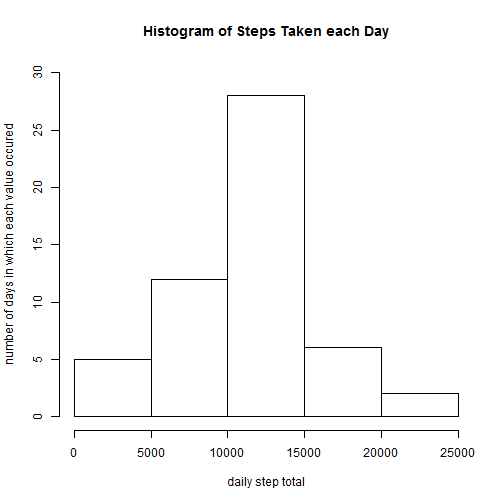
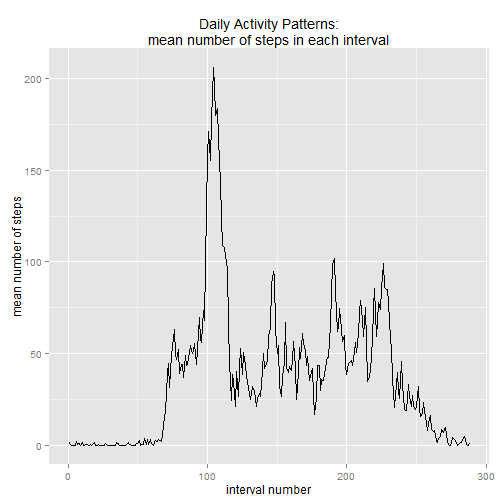
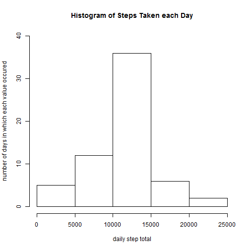
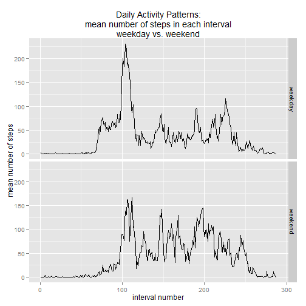

A Glimpse at Personal Activity Monitoring
========================================= 
Prepared: 2014-08-13 19:23:06

##Introduction
This assignment makes use of data from a personal activity monitoring device, which was used to collect the number of steps taken by an anonymous person during the months of October and November, 2012. The data was made available to students by the course instructors. No additional information on data provenance was provided. The variables included in this dataset are:

* **steps**: Number of steps taking in a 5-minute interval (missing
    values are coded as `NA`)

* **date**: The date on which the measurement was taken in YYYY-MM-DD
    format

* **interval**: Identifier for the 5-minute interval in which
    measurement was taken

##Loading and Preprocessing the Data
First we set directories and download and unzip the data file, recording the download time and date to the vector `download_date`. Next we loaded libraries used in this project. We read data from the provided csv file into an R dataframe, `act`, setting column classes appropriately. We built another data frame, `daily`, holding daily summary data, the total daily number of steps and mean number of steps per interval for that day. Finally, we built a data frame (`by_interval`) which contains mean number of steps for each of the 288 intervals in a 24-hour day, averaged across all days of the study.

```r
initial_dir <- getwd()
data_path <- "C:/Users/Liz/Documents/RepData_PeerAssessment1" #choose where you want the data 
setwd(data_path)
options(scipen = 9)
##create if not present directory structure and download and unzip data if not present
if(!file.exists("./activity.zip")){
    download_date <- Sys.time()
    download.file(url ="https://d396qusza40orc.cloudfront.net/repdata%2Fdata%2Factivity.zip",
    destfile = "./activity.zip")}
if(!file.exists("./activity.csv")) {
        unzip("./activity.zip")}

library(plyr)
library(ggplot2)
library(timeDate)
colclasses <- c("numeric", "character", "numeric")
act <- read.csv("activity.csv", header=TRUE, colClasses=colclasses,
                stringsAsFactors=FALSE, nrows=17569)
act$date <- as.Date(act$date)
act$interval_num <- c(1:288)
daily <- ddply(act, ~date, summarise, sum_steps=sum(steps), mean_steps=mean(steps))
by_interval <- ddply(act, ~interval_num, summarise, mean_steps=mean(steps, na.rm = TRUE))
```
  
##What is the mean total number of steps taken per day?
To initially answer this question, NA values in the dataset were simply ignored, using `na.rm=TRUE`. This histogram shows the number of steps taken each day. During the two-month study period, the most common number of steps taken was 10,000-15,000 occuring on nearly half of the days studied. The mean total number of steps taken each day of this study was 10766
, while the median number was 10765.
 
  
##What is the average daily activity pattern?

The time series plot below shows the average number of steps taken in each 5 minute inteval, averaged across all days.The 104th interval contains the maximum daily number of steps. This interval corresponds to 08:40 AM to 08:45 AM.

 
  
##Imputing missing values

There are a number of missing values in the dataset. In fact, there are 2304 intervals in the dataset which had missing data. In order to further our analysis of the data, it was necessary to fill in the missing values. We employed a fairly unsophisticated strategy for doing so, choosing to replace any missing interval with the average value for that interval across the study period. (Note that this strategy bears a cost of partially obscuring activity differences on weekdays vs. weekends, as discussed in that section of this report.) We created new dataframe, `act_new`, to store this new dataset, and a new summary dataframe, `daily_new`, which hold the same type of data as `daily` detailed above.  The code used to carry out the imputation is as follows:

```r
act_new <- act
#ugly loop method for replacing NA's with the average for that 5-minute interval
for (i in 1:length(act_new$steps)){
        if (is.na(act_new$steps[i])) {
                replace_marker <- act_new$interval_num[i]
                new_value <- by_interval$mean_steps[by_interval$interval_num == replace_marker]
                act_new$steps[i] <- new_value
                i = i+1
        } else {#i = i+1
        }
}
daily_new <- ddply(act_new, ~date, summarise, sum_steps=sum(steps), mean_steps=mean(steps))
```


A histogram of the new dataset follows. It is broadly similar to that created from the original dataset, in that the most common number of steps taken during the two-month study period remains 10,000-15,000. After adjusting the dataset for missing data, the average daily number of steps falls into that interval on slightly more than half of the days. As expected, replacing `NA` data with means pulled the distribution of daily step totals more strongly to the center, as evidenced by the greater number of days falling within the interval in the histogram which includes the mean and median values. Replacing `NA` values with the interval mean only slightly impacted the mean and median total number of steps taken per day. This is because the large number of 0's in the original dataset so strongly influence the mean and median. In the original dataset, 11014 observations out of 17568 are zeros; in the new dataset 11166 observations out of 17568 are zeros.The median total number of steps taken each day of this study using the adjusted dataset shifted only slightly, from 10765 in the original dataset to 10766. Predictably, the mean stayed the same, 10766 in the original dataset and 10766 in the adjusted dataset.
  
 
  
##Are there differences in activity patterns between weekdays and weekends?
The following time series plot contrasts activity patterns on weekdays and weekends. The plot shows a peak of activity on weekdays from about 07:55 AM to 09:35 AM. The weekend plot shows a similar peak, however it is both of smaller overall magnitude and also appears eroded. This suggests that the persistance of this peak on weekends may be due to the method used to impute data; as weekdays outnumber weekends, the imputation method used will weight replacement data to being more similar to weekday data. In general, the plots show greater activity all day on weekends, relative to weekdays which primarily show a burst of activity in the morning, with perhaps a second smaller burst at the end of the working day, from about 05:55 PM to 07:10 PM. As with the peak data, the imputation method has probably blurred the differences between weekends and weekdays. A more robust imputation method, perhaps simply creating separate interval means for weekends and weekdays might make the differences more discernable. 
  
 
  
